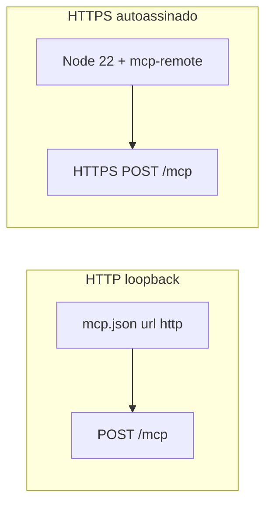

# Conectividade Cursor ↔ MCP

HTTP em loopback é o caminho simples. HTTPS local com certificado autoassinado **não** funciona no Cursor só com `dotnet dev-certs https --trust` e `"url": "https://localhost:7071/mcp"`.

Em produção, com certificado de CA pública, o Cursor aceita `"url": "https://mcp.dominio/mcp"` sem proxy.



O servidor deve ter `https://www.cursor.com/agents/mcp/oauth/callback` na lista `SpikeAuth:Clients[].RedirectUris` da aplicação pré-registrada. Sem isso o Authenticate abre `GET /mcp` e o browser mostra **405**. Não há `POST /register`: o `client_id` precisa ser o cadastrado (padrão `cursor-mcp-spike`).

Não use bloco `auth` / `CLIENT_ID` no `mcp.json`. Depois de mudar o arquivo, recarregue a **janela** do Cursor (Developer: Reload Window), não só o MCP.

---

## HTTP (simples)

Use isto em loopback, a menos que o spike precise exercitar TLS.

1. Kestrel e `SpikeAuth.PublicBaseUrl` em `http://localhost:7071`.
2. `.cursor/mcp.json`:

```json
{
  "mcpServers": {
    "cursor-mcp-spike": {
      "url": "http://localhost:7071/mcp"
    }
  }
}
```

3. `dotnet run --project src/CursorMcp.Server --launch-profile https` (o profile ainda se chama `https`; o que vale é a URL no `appsettings.json`).
4. Reload Window → Authenticate → **Entrar como demo-user** → tool `hello_world`.

---

## HTTPS local (autoassinado)

O `fetch` nativo do Cursor não usa o store do Windows. O fluxo que funcionou neste PC: Node **22** + `mcp-remote` (`proxy.js`) + PEM em `NODE_EXTRA_CA_CERTS`.

### 1. Subir o servidor HTTPS

`appsettings.json`: endpoint `https://localhost:7071` e `SpikeAuth.PublicBaseUrl` igual.

```bash
dotnet run --project src/CursorMcp.Server --launch-profile https
```

### 2. Qual Node usar

Neste Windows `where node` mostrou dois:

| Path | Versão | Usar? |
| --- | --- | --- |
| `C:\Users\herna\AppData\Local\nodejs-lts\node.exe` | **v22.17.1** | Sim |
| `C:\Program Files\nodejs\node.exe` | **v12.14.0** (npm 6) | Não |

O spawn MCP do Cursor **não** herda o PATH do Git Bash: ele pegou o Node 12. No `mcp.json`, `command` deve ser o caminho **absoluto** do Node **≥ 18**. Não use `npx`, `node` ou `npm` sem path.

Conferir:

```bash
"C:/Users/herna/AppData/Local/nodejs-lts/node.exe" -v
```

Deve imprimir `v22.x`. Se o LTS mudar de pasta, atualize o `command` no `mcp.json`.

Instale `mcp-remote` **com esse mesmo Node 22** na raiz do repo (`npm install`). `package.json` já declara a dependência.

### 3. Gerar o `.pem`

`dotnet dev-certs https --trust` só entra no store do Windows (browser / PowerShell). Node/undici **não** lê esse store.

Exporte o certificado público (sem chave privada):

```bash
mkdir -p certs
dotnet dev-certs https -ep certs/localhost.pem --format Pem --no-password
```

- `--format Pem`: texto `BEGIN CERTIFICATE` (não PFX).
- `--no-password`: sem criptografar.
- Neste spike o arquivo saiu **só** com o certificado (sem `BEGIN PRIVATE KEY`). É o que `NODE_EXTRA_CA_CERTS` precisa.

`certs/` está no `.gitignore`. Não commitar o PEM.

Validar com o Node 22:

```bash
node -e "fetch('https://localhost:7071/health').then(()=>console.log('inesperado')).catch(e=>console.log(e.cause&&e.cause.code))"
# esperado: DEPTH_ZERO_SELF_SIGNED_CERT

NODE_EXTRA_CA_CERTS=certs/localhost.pem node -e "fetch('https://localhost:7071/health').then(r=>console.log(r.status))"
# esperado: 200
```

### 4. Por que `proxy.js` (não `"url"` / `npx`)

O pacote `mcp-remote` expõe o bin `mcp-remote` → `node_modules/mcp-remote/dist/proxy.js`. É um **proxy stdio → Streamable HTTP**: o Cursor fala MCP por stdin/stdout; o Node 22 faz o `fetch` HTTPS até `https://localhost:7071/mcp` já confiando no PEM.

- `"url": "https://localhost:7071/mcp"` usa o fetch **interno** do Cursor. Esse fetch ignora o store do Windows e **não** honra `NODE_EXTRA_CA_CERTS` do `mcp.json` (`env` só vale para servidor stdio). Resultado: `fetch failed` / `DEPTH_ZERO_SELF_SIGNED_CERT`.
- `npx -y mcp-remote https://localhost:7071/mcp` falhou aqui: npm 6 interpretou a URL como **pacote para instalar** (`npm install https://localhost:7071/mcp`) → `UNABLE_TO_VERIFY_LEAF_SIGNATURE` → MCP **-32000 Connection closed**. O `--` não evitou isso nesse npx.

Por isso o `mcp.json` chama **direto** o `node.exe` v22 + `dist/proxy.js` + URL + `NODE_EXTRA_CA_CERTS`. Sem `npx`.

### 5. `mcp.json` que funcionou

```json
{
  "mcpServers": {
    "cursor-mcp-spike": {
      "command": "C:/Users/herna/AppData/Local/nodejs-lts/node.exe",
      "args": [
        "C:/_projeto/cursor-mcp/node_modules/mcp-remote/dist/proxy.js",
        "https://localhost:7071/mcp",
        "9999",
        "--host",
        "127.0.0.1",
        "--static-oauth-client-info",
        "@C:/_projeto/cursor-mcp/.cursor/oauth-client-info.json"
      ],
      "env": {
        "NODE_EXTRA_CA_CERTS": "C:/_projeto/cursor-mcp/certs/localhost.pem"
      }
    }
  }
}
```

Sem DCR no AS, o `mcp-remote` precisa de `--static-oauth-client-info` com o `client_id` pré-registrado (`cursor-mcp-spike`). Porta `9999` + host `127.0.0.1` alinham o callback padrão (`/oauth/callback`) ao cadastro em `SpikeAuth:Clients`. O JSON do client fica em `.cursor/oauth-client-info.json`.

**Importante:** se existir `~/.cursor/mcp.json` (user-level), o Cursor usa esse arquivo (namespace `user-…`) e **ignora** o `.cursor/mcp.json` do projeto para esse server name. Mantenha os dois alinhados, ou remova a entrada antiga do user-level.

Reload Window → Authenticate. O browser deve abrir `/login`, não `/mcp`. Entrar como `demo-user`. Confirmar `hello_world`.
Se ainda aparecer `dyn-*` / DCR, apague `~/.mcp-auth/mcp-remote-v1/` e recarregue.

### 6. Detalhes técnicos (o que cada peça faz)

| Peça | Função |
| --- | --- |
| `C:/Users/herna/AppData/Local/nodejs-lts/node.exe` | Runtime **v22**. O PATH do MCP do Cursor neste PC resolve `C:\Program Files\nodejs` (**v12** / npm 6). Sem path absoluto o spawn usa o Node velho. |
| `node_modules/mcp-remote/dist/proxy.js` | Bin stdio → Streamable HTTP. O Cursor não faz TLS; quem faz `fetch` HTTPS é este processo. |
| `https://localhost:7071/mcp` | Resource MCP (JWT `aud`). |
| `9999` | Porta do callback HTTP local que o `mcp-remote` sobe (`http://127.0.0.1:9999/oauth/callback`). |
| `--host 127.0.0.1` | Evita `localhost` vs IPv6 (`::1`) no callback. |
| `--static-oauth-client-info @.cursor/oauth-client-info.json` | Força `client_id=cursor-mcp-spike`. Sem isso o `mcp-remote` tenta DCR (`dyn-*`) e o AS deste spike recusa. |
| `NODE_EXTRA_CA_CERTS` | CA extra **só** para o Node do proxy. O fetch interno do Cursor não lê esta variável. |
| `certs/localhost.pem` | Export do `dotnet dev-certs` (`BEGIN CERTIFICATE`). Gitignored. |
| `SpikeAuth:Clients` | Cadastro B2C-like. Sem `POST /register`. |

Matching de `redirect_uri` (`OAuthClient.AllowsRedirectUri`): igualdade exata **ou**, em loopback, mesmo scheme + host + path **ignorando a porta** (comportamento de app nativa Entra/B2C). Por isso `http://127.0.0.1:9999/oauth/callback` casa com o URI cadastrado mesmo se a porta efetiva variar.

`GET /mcp` é só Streamable HTTP (POST). Se o Authenticate abrir essa URL no browser → **405**: OAuth não chegou em `/authorize` (quase sempre `client_id`/`redirect_uri` errados).

Precedência do Cursor: se existir `~/.cursor/mcp.json` com o mesmo server name, o namespace vira `user-…` e o `.cursor/mcp.json` **do projeto é ignorado**.

---

## Produção

Certificado de CA pública (Let’s Encrypt, corporativa já na Mozilla CA):

```json
{
  "mcpServers": {
    "cursor-mcp-spike": {
      "url": "https://mcp.seudominio.com/mcp"
    }
  }
}
```

Sem `mcp-remote`, sem PEM, sem pin de Node.

---

## Instruções para outra IA

Copiar e seguir nesta ordem. Não inventar `"url"` HTTPS nativo contra cert autoassinado.

1. Se o serviço puder ser HTTP em loopback: `appsettings` + `PublicBaseUrl` em `http://localhost:7071`; `.cursor/mcp.json` só com `"url": "http://localhost:7071/mcp"`; sem `auth`/`CLIENT_ID`.
2. Garantir o cliente pré-registrado: `client_id=cursor-mcp-spike` e `https://www.cursor.com/agents/mcp/oauth/callback` em `RedirectUris`. Sem isso Authenticate → `GET /mcp` → **405**. DCR (`POST /register`) não faz parte deste spike.
3. Se tiver de ser HTTPS autoassinado: nunca `"url": "https://..."` no Cursor; nunca `npx`.
4. Descobrir Node: `where node`. Usar path absoluto de **v22+** (`nodejs-lts` neste PC). **Não** usar `C:\Program Files\nodejs\node.exe` se for v12.
5. Com esse Node: `npm install` na raiz (dependência `mcp-remote`). Entrypoint: `node_modules/mcp-remote/dist/proxy.js` (stdio → HTTP; o Cursor não faz o TLS).
6. PEM: `dotnet dev-certs https -ep certs/localhost.pem --format Pem --no-password`. `mcp.json` `env.NODE_EXTRA_CA_CERTS` apontando para esse arquivo.
7. `mcp.json` (projeto **e** `~/.cursor/mcp.json` se existir) `command` = node.exe v22; `args` = `[proxy.js, https://localhost:7071/mcp, 9999, --host, 127.0.0.1, --static-oauth-client-info, @.cursor/oauth-client-info.json]`.
8. Developer: Reload Window. Authenticate → `/login` → `demo-user` → `hello_world`.
9. Sintomas: **405** → `redirect_uri`/`client_id` não cadastrados; **-32000** → npx/Node velho instalando a URL; `fetch failed` → TLS do host Cursor (não usar `"url"` HTTPS local).
